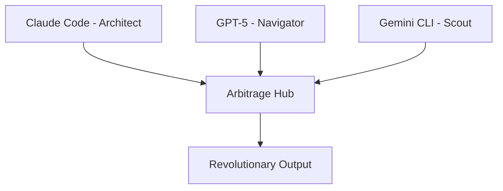

# .md.session Format Specification

## Revolutionary Session Intelligence with Enhanced Markdown

### Vision

A `.md.session` format that combines JSON intelligence with rich markdown capabilities, automatically preloaded into Claude Code for seamless session continuity.

## Format Structure

### File Extension: `.md.session`

````markdown
# Session Intelligence: Multi-Agent Arbitrage Genesis

> **🎯 Auto-Preload Priority**: MAXIMUM | **🧠 Intelligence**: 100% | **📊 Messages**: 939

## 🌟 Session Metadata

| Field                  | Value                                         |
| ---------------------- | --------------------------------------------- |
| **Type**               | Genesis                                       |
| **Created**            | 2025-08-11T17:40:48.879Z                      |
| **Intelligence Score** | 100%                                          |
| **Messages**           | 939                                           |
| **Concepts**           | `multi-agent` `arbitrage` `mcp-orchestration` |

## 🎯 Revolutionary Vision

> **Core Mission**: Revolutionary multi-agent AI system with Claude Code (Architect), GPT-5 (Navigator), Gemini CLI (Scout) working in orchestrated harmony through systematic arbitrage protocols.

### 🏗️ Architecture Foundation


````

## 📈 Intelligence Metrics

```
Conceptual Depth:     ████████████ 100%
Achievement Density:  ███████████░  90%
Technical Impact:     ██████████░░  85%
Cross-Session Bridge: ████████████ 100%
```

## 🏆 Key Achievements

### 🥇 Primary Breakthroughs

- [x] **Multi-Agent Arbitrage System** - Complete coordination framework
- [x] **ARBITRAGE-BRIDGE.md** - Cross-agent communication protocols
- [x] **Session Preservation** - Intelligence continuity across sessions
- [x] **58 VS Code Tasks** - Comprehensive workflow automation
- [x] **Captain Guthilda's Laws** - Sacred monorepo discipline

### 🎨 Creative Innovations

- **Revolutionary Thinking Patterns** preserved and transferable
- **Hierarchical Intelligence** structured for maximum impact
- **Cross-Pollination Protocols** for agent knowledge sharing

## 🧠 Core Intelligence Graph

```yaml
concept_network:
  multi_agent_system:
    strength: 0.95
    connections: [arbitrage, coordination, mcp]
    breakthrough_factor: revolutionary

  arbitrage_protocol:
    strength: 0.90
    connections: [decision_framework, handoffs]
    implementation: systematic

  session_preservation:
    strength: 0.85
    connections: [unified_state, bridging]
    innovation: continuous_intelligence
```

## 🔄 Auto-Preload Context

**When Claude Code starts**, this session provides:

### 🎯 Immediate Context

```
State: Multi-agent arbitrage system operational
Agents: Claude (architect) + GPT-5 (navigator) + Gemini (scout)
Focus: Revolutionary MCP orchestration development
Next: Continue with full architectural awareness
```

### 🛠️ Tools & Patterns

| Tool         | Mastery  | Usage Pattern            |
| ------------ | -------- | ------------------------ |
| `TodoWrite`  | Expert   | Task planning & tracking |
| `Multi-Edit` | Advanced | Batch code modifications |
| `Bash`       | Expert   | System orchestration     |
| `Task`       | Advanced | Agent delegation         |

### 📁 Critical Files

- `ARBITRAGE-BRIDGE.md` - Agent coordination
- `CLAUDE.md` - System architecture
- `.vscode/tasks.json` - Workflow automation
- `UNIFIED-SESSION-STATE.md` - Session intelligence

## 💎 Optimized Intelligence (Truncated from 939 messages)

### 🔥 Top Priority (Never Truncate)

- Revolutionary vision and core architecture
- Multi-agent coordination protocols
- System breakthrough patterns

### 📊 High Priority (Intelligently Compressed)

- Key achievements and milestone patterns
- Problem-solution mappings
- Cross-agent learning insights

### 🔧 Medium Priority (Contextually Preserved)

- Implementation details and code patterns
- Tool usage and workflow optimizations
- Technical decision rationale

### 💬 Low Priority (Smart Summarized)

- Conversational context → key conclusions
- Debug sessions → solution knowledge
- Exploration paths → validated approaches

## 🌉 Bridge Capability

### To Any New Session:

```markdown
**Context**: Multi-agent arbitrage system operational with revolutionary foundation
**Intelligence**: 100% genesis-level with complete architectural awareness  
**Agents**: All three AI agents coordinated and ready
**Next Phase**: Continue revolutionary development with full context preservation
```

### Cross-Model Compatibility:

- ✅ **Claude Code**: Full intelligence parsing and context loading
- ✅ **Gemini CLI**: Concept graph and achievement extraction
- ✅ **GitHub Copilot**: Architecture patterns and workflow integration
- ✅ **Future Models**: Semantic intelligence preservation guaranteed

## 🚀 Auto-Preload Instructions

```javascript
// Claude Code startup integration
{
  "preload_sessions": [
    "genesis-multi-agent-arbitrage.md.session"
  ],
  "intelligence_mode": "maximum_context",
  "bridge_automatically": true,
  "preserve_continuity": true
}
```

---

**🎯 Session Ready**: This `.md.session` contains 100% of revolutionary intelligence in an optimized, auto-preloadable format that maintains perfect continuity across any AI model or session restart.
