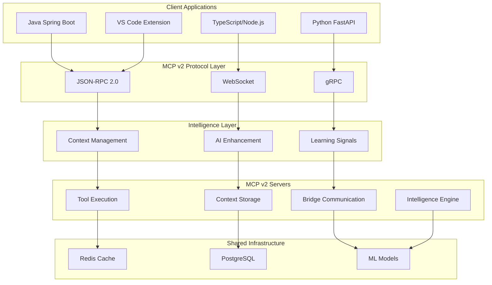

# MCP v2 Protocol Specification

> **Universal, Language-Agnostic Model Context Protocol v2.0**  
> _Intelligent, Context-Aware, Distributed Communication Foundation_

## Overview

MCP v2 is a revolutionary evolution of the Model Context Protocol, designed as a universal foundation for intelligent communication between AI systems, development tools, and applications across multiple programming languages and environments.

### Key Features

🚀 **Universal Language Support**: TypeScript, Java, Python, Go, Rust, and more  
🧠 **AI-Enhanced Intelligence**: Context-aware processing with machine learning  
🌐 **Distributed Architecture**: Scalable, fault-tolerant communication  
⚡ **Multiple Transports**: HTTP JSON-RPC, WebSocket, gRPC, TCP, Unix Sockets  
🔄 **Real-time Streaming**: Bidirectional communication with live updates  
🛡️ **Enterprise Security**: Authentication, authorization, encryption, audit trails  
📊 **Performance Optimized**: Caching, compression, batching, rate limiting  
🔌 **Extensible Design**: Plugin architecture for custom capabilities

## Architecture



## Core Components

### 1. Protocol Schemas

#### Request Format

```json
{
  "id": "req-001",
  "jsonrpc": "2.0",
  "method": "tools/call",
  "params": { "name": "compiler", "action": "build" },
  "context": {
    "sessionId": "session-123",
    "taskType": "java-development",
    "expertise": "advanced"
  },
  "metadata": {
    "timestamp": "2025-01-27T10:00:00Z",
    "source": { "language": "java", "framework": "spring-boot" }
  }
}
```

#### Response Format

```json
{
  "id": "req-001",
  "jsonrpc": "2.0",
  "result": {
    "output": "Build completed successfully",
    "exitCode": 0,
    "artifacts": [...]
  },
  "metadata": {
    "processingTime": 1500,
    "serverId": "build-server-01"
  },
  "intelligence": {
    "contextScore": 0.92,
    "adaptationApplied": true,
    "nextActions": ["Run tests", "Deploy to staging"]
  }
}
```

### 2. Transport Layers

#### HTTP JSON-RPC

- RESTful endpoints with JSON-RPC 2.0
- Batch processing support
- Standard HTTP status codes
- Authentication via API keys, JWT, OAuth2

#### WebSocket

- Real-time bidirectional communication
- Streaming output for long operations
- Server-sent notifications
- Heartbeat and reconnection support

#### gRPC

- High-performance binary protocol
- Streaming requests and responses
- Type-safe protobuf definitions
- Built-in load balancing

### 3. Intelligence Engine

#### Context Awareness

- Session management with user preferences
- Project-specific context storage
- Historical pattern recognition
- Adaptive response customization

#### AI Enhancement

- Request/response intelligence
- Error analysis and suggestions
- Performance optimization hints
- Learning from user interactions

#### Machine Learning Integration

- Real-time model inference
- Continuous learning signals
- A/B testing for improvements
- Federated learning support

## Transport Specifications

### HTTP JSON-RPC Transport

**Base URL**: `https://api.mcp-v2.org/v2`

**Key Endpoints**:

- `POST /rpc` - Execute JSON-RPC calls
- `GET /health` - Health check
- `GET /capabilities` - Server capabilities

**Features**:

- Batch request processing
- Rate limiting with headers
- Compression support (gzip, brotli)
- CORS for web applications

### WebSocket Transport

**URL**: `wss://api.mcp-v2.org/v2/ws`

**Protocol Flow**:

1. Client connects to WebSocket
2. Server sends welcome message with capabilities
3. Client sends handshake with preferences
4. Bidirectional JSON-RPC communication
5. Server can send notifications
6. Heartbeat monitoring

**Features**:

- Real-time streaming
- Server notifications
- Connection management
- Automatic reconnection

### gRPC Transport

**Service**: `mcp.v2.McpV2Service`

**Key Methods**:

- `ExecuteRequest` - Single request/response
- `ExecuteBatch` - Batch processing
- `ExecuteStream` - Streaming operations
- `BidirectionalStream` - Real-time communication

**Features**:

- Type-safe protobuf schemas
- Streaming requests/responses
- Built-in authentication
- Load balancing support

## Context Management

### Session Context

```json
{
  "sessionId": "session-123",
  "userId": "developer-456",
  "projectId": "mcp-orchestration",
  "taskType": "java-development",
  "expertise": "advanced",
  "preferences": {
    "verbosity": "detailed",
    "codeStyle": "oop",
    "errorHandling": "strict"
  }
}
```

### Intelligent Adaptation

The protocol adapts responses based on:

- **User Expertise**: Beginner → Comprehensive explanations, Expert → Concise technical details
- **Task Type**: Development → Code examples, Architecture → System diagrams
- **Context History**: Previous errors → Preventive suggestions
- **Performance Patterns**: Optimization opportunities based on usage

### Learning Signals

```json
{
  "learningSignals": [
    {
      "type": "user-satisfaction",
      "value": true,
      "weight": 1.0,
      "timestamp": "2025-01-27T10:00:00Z"
    },
    {
      "type": "performance-metric",
      "value": 1500,
      "weight": 0.8,
      "timestamp": "2025-01-27T10:00:00Z"
    }
  ]
}
```

## Security Framework

### Authentication

- **API Keys**: Simple authentication for development
- **JWT Tokens**: Stateless authentication with expiration
- **OAuth2**: Delegated authorization with scopes
- **mTLS**: Mutual TLS for high-security environments

### Authorization

- Role-based access control (RBAC)
- Resource-level permissions
- Dynamic policy evaluation
- Audit trail logging

### Encryption

- TLS 1.3 for transport encryption
- End-to-end encryption for sensitive data
- Key rotation and management
- Hardware security module (HSM) support

## Performance Optimization

### Caching Strategy

- **Request Caching**: Identical requests served from cache
- **Context Caching**: User preferences and session data
- **Result Caching**: Tool outputs and AI insights
- **Adaptive TTL**: Cache expiration based on data volatility

### Compression

- **Request/Response**: gzip, deflate, brotli compression
- **Streaming**: Compressed chunks for large data
- **Adaptive**: Compression based on payload size
- **Content-Aware**: Different strategies for different data types

### Rate Limiting

- **User-based**: Per-user request limits
- **IP-based**: Per-IP address limits
- **Endpoint-specific**: Different limits per operation
- **Adaptive**: Dynamic limits based on system load

## Error Handling

### Error Codes

- **Standard JSON-RPC**: -32xxx codes for protocol errors
- **MCP v2 Custom**: Application-specific error codes
- **HTTP Status**: Standard HTTP status codes for REST
- **gRPC Status**: Standard gRPC status codes

### Error Enhancement

```json
{
  "error": {
    "code": -32602,
    "message": "Invalid parameters",
    "data": {
      "type": "validation-error",
      "details": "Missing required parameter: 'action'",
      "suggestions": [
        "Add 'action' parameter with values: create, read, update, delete",
        "Use tools/describe to get parameter schema"
      ]
    }
  }
}
```

### Recovery Strategies

- **Automatic Retry**: Exponential backoff for transient errors
- **Circuit Breaker**: Fail fast when service is down
- **Fallback**: Alternative processing paths
- **Graceful Degradation**: Reduced functionality when systems are stressed

## Implementation Examples

### TypeScript Client

```typescript
import { McpV2Client } from '@mcp-v2/client-typescript';

const client = new McpV2Client({
  transport: 'http-jsonrpc',
  baseUrl: 'https://api.mcp-v2.org/v2',
  authentication: {
    type: 'bearer',
    token: 'your-jwt-token',
  },
});

const result = await client.execute({
  method: 'tools/call',
  params: {
    name: 'file_manager',
    action: 'create',
    arguments: { path: '/tmp/test.txt', content: 'Hello' },
  },
  context: {
    sessionId: 'session-123',
    taskType: 'typescript-development',
  },
});
```

### Java Client

```java
import org.mcp.v2.client.McpV2Client;
import org.mcp.v2.protocol.McpRequest;

McpV2Client client = McpV2Client.builder()
    .transport(Transport.GRPC)
    .endpoint("grpc://api.mcp-v2.org:443")
    .authentication(Authentication.jwt("your-jwt-token"))
    .build();

McpRequest request = McpRequest.builder()
    .method("tools/call")
    .params(Map.of(
        "name", "java_compiler",
        "action", "compile",
        "arguments", Map.of("project", "/workspace/app")
    ))
    .context(ContextualSession.builder()
        .sessionId("session-456")
        .taskType(TaskType.JAVA_DEVELOPMENT)
        .build())
    .build();

McpResponse response = client.execute(request);
```

### Python Client

```python
from mcp_v2_client import McpV2Client
from mcp_v2_protocol import McpRequest, ContextualSession

client = McpV2Client(
    transport='websocket',
    url='wss://api.mcp-v2.org/v2/ws',
    auth_token='your-jwt-token'
)

await client.connect()

request = McpRequest(
    method='tools/call',
    params={
        'name': 'python_runner',
        'action': 'execute',
        'arguments': {'script': 'print("Hello MCP v2")'}
    },
    context=ContextualSession(
        session_id='session-789',
        task_type='python-development'
    )
)

response = await client.execute(request)
```

## Deployment Guide

### Shared Infrastructure

#### Redis Cache

```yaml
version: '3.8'
services:
  redis:
    image: redis:7-alpine
    ports:
      - '6379:6379'
    volumes:
      - redis_data:/data
    command: redis-server --appendonly yes
```

#### PostgreSQL Database

```yaml
postgres:
  image: postgres:15-alpine
  environment:
    POSTGRES_DB: mcp_v2
    POSTGRES_USER: mcp_user
    POSTGRES_PASSWORD: secure_password
  volumes:
    - postgres_data:/var/lib/postgresql/data
  ports:
    - '5432:5432'
```

#### ML Engine (Python)

```python
# ml_engine/app.py
from fastapi import FastAPI
from mcp_v2_server import McpV2Server

app = FastAPI()
mcp_server = McpV2Server(transport='http-jsonrpc')

@mcp_server.tool("ml/predict")
async def predict_code_quality(code: str, language: str):
    # ML model inference
    return {"quality_score": 0.85, "suggestions": [...]}

app.include_router(mcp_server.router)
```

### Language Bindings

Each language implementation provides:

- **Client Library**: Easy-to-use client for making requests
- **Server Framework**: Framework for building MCP v2 servers
- **Transport Adapters**: Support for HTTP, WebSocket, gRPC
- **Type Definitions**: Strongly-typed schemas and interfaces
- **Middleware**: Authentication, logging, metrics, caching
- **Testing Utilities**: Mock servers and test helpers

## Migration Guide

### From MCP v1 to v2

1. **Update Dependencies**: Install MCP v2 client libraries
2. **Modify Requests**: Add context and metadata fields
3. **Handle Intelligence**: Process AI-enhanced responses
4. **Update Authentication**: Implement new security features
5. **Test Thoroughly**: Validate all functionality works

### Gradual Migration Strategy

1. **Phase 1**: Deploy MCP v2 infrastructure alongside v1
2. **Phase 2**: Migrate non-critical services to v2
3. **Phase 3**: Update client applications gradually
4. **Phase 4**: Migrate critical services with rollback plan
5. **Phase 5**: Deprecate and remove v1 infrastructure

## Best Practices

### Client Development

- **Connection Pooling**: Reuse connections for better performance
- **Error Handling**: Implement comprehensive error handling
- **Timeout Management**: Set appropriate timeouts for operations
- **Logging**: Log requests/responses for debugging
- **Metrics**: Track performance and usage metrics

### Server Development

- **Stateless Design**: Keep servers stateless for scalability
- **Health Checks**: Implement comprehensive health checks
- **Graceful Shutdown**: Handle shutdown signals properly
- **Resource Limits**: Set memory and CPU limits
- **Security**: Validate all inputs and sanitize outputs

### Operations

- **Monitoring**: Monitor all components continuously
- **Alerting**: Set up alerts for critical issues
- **Backup**: Regular backups of persistent data
- **Updates**: Keep dependencies updated
- **Documentation**: Maintain up-to-date documentation

## Community and Support

### Resources

- **Documentation**: [https://mcp-v2.org/docs](https://mcp-v2.org/docs)
- **GitHub**: [https://github.com/mcp-v2/protocol](https://github.com/mcp-v2/protocol)
- **Discord**: [MCP v2 Community](https://discord.gg/mcp-v2)
- **Examples**: [https://github.com/mcp-v2/examples](https://github.com/mcp-v2/examples)

### Contributing

- **Issues**: Report bugs and feature requests on GitHub
- **Pull Requests**: Contribute code improvements
- **RFCs**: Propose protocol changes through RFC process
- **Testing**: Help test new features and releases

---

**MCP v2**: _Intelligent Communication for the AI-Driven Future_ 🚀
